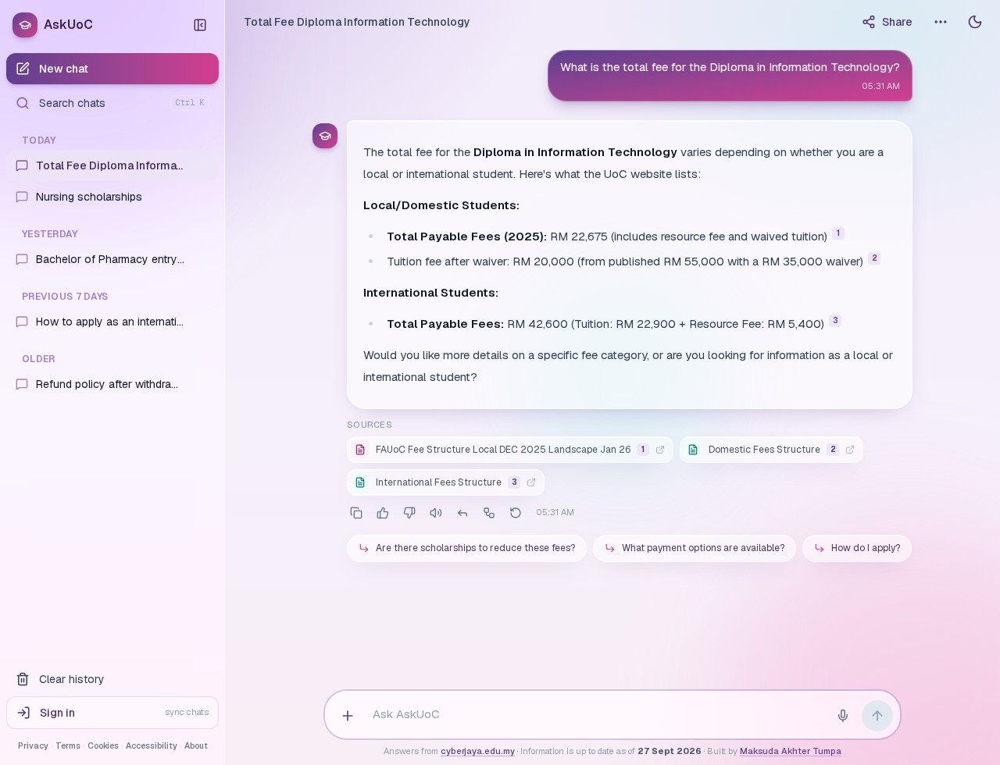
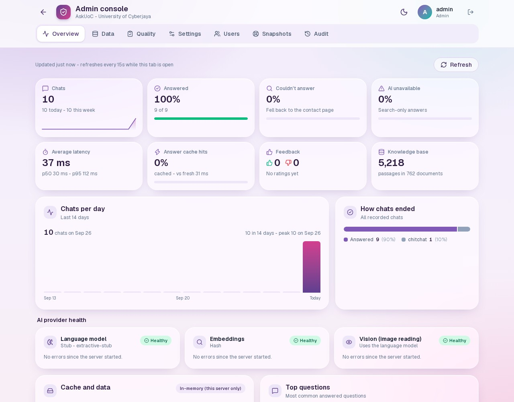
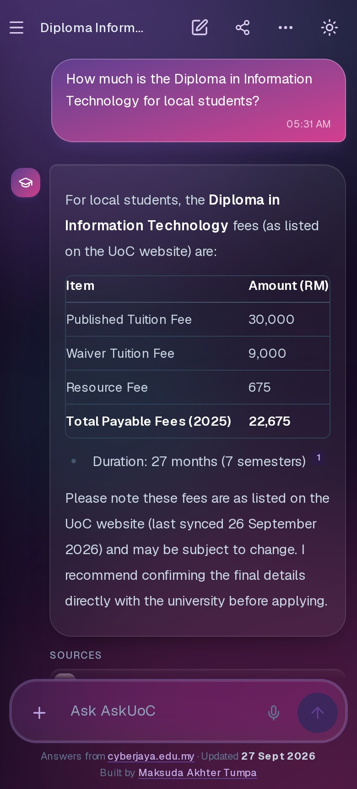
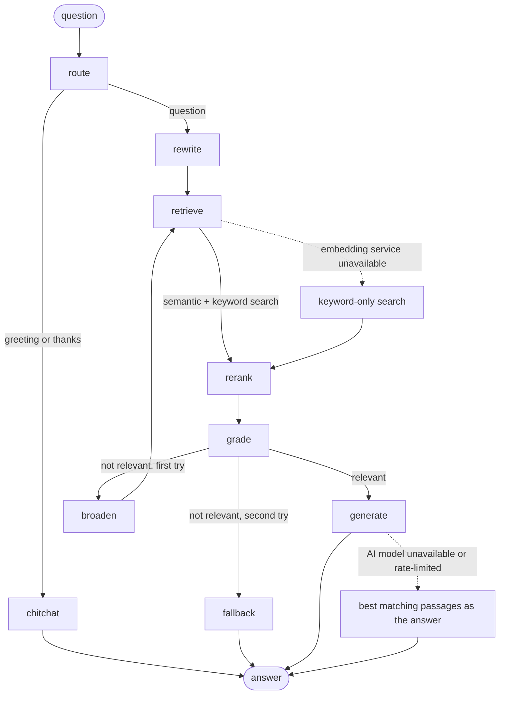

# AskUoC

A chatbot that answers questions about the University of Cyberjaya (programmes, fees, scholarships, admission, campus life)
using the university's own website, with a cited source for every answer.

<p align="center">
  
</p>

      
      
      
      

| Admin console | Phone, dark mode |
|---|---|
|  |  |

**Free hosting:** Vercel (web) · Hugging Face Spaces (API) · Supabase (database) · Upstash (Redis, optional) · GitHub Actions (CI/CD)

## Features

- **Cited answers** from a hybrid search (embeddings + full text) over the university website, with inline `[n]` references.
- **Chat UI** with streaming, dark mode, mobile layout, search across chats, pin / archive / rename / share, and image or PDF
  attachments (up to 5, PDFs are rendered to images in the browser).
- **Voice:** dictation in the browser and read-aloud with edge-tts.
- **Accounts with automatic roles** (user, staff, admin) from a single sign-in form. Signed-in users sync chats across
  devices, and can edit their profile, export their data and delete their account.
- **Admin console:** usage and provider health, document upload and re-embedding, live model / endpoint / API key settings
  (keys encrypted at rest), user management, snapshots with one-click restore, audit log.
- **How it answered:** each reply shows the pipeline steps with timings, plus suggested follow-up questions.
- **Resilient to API limits:** quota, rate-limit and outage errors get plain-language messages; when the model is
  unavailable the best matching passages are still shown.
- **Privacy pages, security headers, rate limiting, OpenTelemetry traces, Prometheus metrics** (see [Observability](#observability)).

## How it works



| Step | What it does |
|---|---|
| `route` | Regex check for greetings and thanks, so small talk costs no model call. |
| `rewrite` | Turns a follow-up ("and the fees?") into a standalone query. |
| `retrieve` | LangChain retriever over the SQL function `match_chunks_hybrid()`: dense + full-text, fused with Reciprocal Rank Fusion. If the embedding service fails, it falls back to keyword-only search. |
| `rerank` | Query-term coverage and title match, at most a few passages per document. |
| `grade` | Answers only if the passages are relevant enough; otherwise one keyword-only retry, then an honest "not found". |
| `generate` | Grounded answer with citations, streamed token by token. If the AI model is unavailable, the best matching passages are shown instead, with a notice. |

More detail in [docs/ARCHITECTURE.md](docs/ARCHITECTURE.md).

## Roles

One sign-in form; the server decides what each account can do, and the UI shows only that.

| | Visitor | User | Staff | Admin |
|---|---|---|---|---|
| Ask questions, share a chat, read aloud | yes | yes | yes | yes |
| Sync chats across devices, profile, export or delete own data | | yes | yes | yes |
| Admin console: Overview (usage, provider health, unanswered questions), document list, jobs, snapshot list | | | yes | yes |
| Upload documents and add FAQ entries | | | yes | yes |
| Delete documents, re-embed everything | | | | yes |
| Settings (model, endpoint, API keys), users, snapshots (create, restore, download), audit log, `/metrics` | | | | yes |

The first admin is created once, from the sign-in dialog, with the `ADMIN_TOKEN` value as the setup key. Admins then create staff
accounts under Users. Roles are enforced on every API route, and changing a role, password or status signs that user out
everywhere. The last admin can't be removed or demoted.

## Observability

- **Traces:** OpenTelemetry over OTLP/HTTP, off until `OTEL_EXPORTER_OTLP_ENDPOINT` is set. One trace per chat with a span for each
  pipeline step (`rag.route`, `rag.retrieve`, `rag.generate`, ...), provider errors marked on the spans. Works with Grafana Cloud's
  free tier or a local Jaeger. Question text is not exported unless you opt in.
- **Logs:** structured JSON in production with request and trace ids; no IP addresses.
- **Metrics:** Prometheus text at `/metrics` (admin only), plus the usage and provider-health view in the admin console.

Setup steps, span names and metrics: [docs/OBSERVABILITY.md](docs/OBSERVABILITY.md).

## Design decisions

| Decision | Choice | Why |
|---|---|---|
| Vector store | Postgres + pgvector | One free database for vectors, full text, accounts and logs; hybrid search is plain SQL. |
| Retrieval | Dense + `tsvector`, fused with RRF | Dense alone misses exact names and numbers (fees); keywords alone miss paraphrases. |
| Fee tables | One chunk per programme row | Generic extractors scrambled the table cells; row chunks fixed both retrieval and correctness. |
| Orchestration | LangGraph graph, not a free-roaming agent | A bounded FAQ domain is better served by an explicit, testable flow. |
| Providers | `LLM_PROVIDER`, `EMBED_PROVIDER`, `STORE` switches with offline implementations | The whole stack runs and is tested without any API key. |
| Caching | Redis (or in-memory), keys include data, model and prompt fingerprints | A changed model, prompt or document can never serve a stale answer. |
| Failure handling | Every external service can fail without taking chat down | Redis, embeddings and the LLM each have a fallback. |

### Data collection

`cyberjaya.edu.my` sits behind a JavaScript-challenge firewall that blocks plain HTTP clients. I did not try to bypass it:
[`ingest/browser_crawl.js`](ingest/browser_crawl.js) runs in a normal browser session on the site's own origin, reads only
sitemap URLs at about 8 pages a minute, and stops if it hits a challenge. `robots.txt` is honoured. The pages are then
imported with `ingest/import_browser.py`.

The domestic fees page embeds an "International Fees" section whose numbers differ from the dedicated page. Chunks keep their
section heading so the model can tell them apart.

## Evaluation

`python eval/run_eval.py` runs a golden question set ([eval/golden.jsonl](eval/golden.jsonl)) against four retrieval modes;
`--answers` adds an LLM-judged score. Results go to [eval/report.md](eval/report.md) (the committed numbers use the offline
hash embeddings; re-run with `EMBED_PROVIDER=gemini` for real ones).

Changes driven by the eval: excluding research-paper pages that crowded out real answers, adding fee-row chunks, and
limiting follow-up query merging so an off-topic question does not inherit the previous topic.

## Run it locally

**You need:** Python 3.12, Node.js 22 and `make`. Docker is optional (`make up` starts Redis and Postgres for the live-service tests).

No API keys needed: the defaults use offline hash embeddings and a stub model that quotes the best passage.

```bash
make setup       # Python virtualenv + npm install
make seed        # tiny demo knowledge base (no crawling needed)
make api         # http://localhost:8000
make web         # http://localhost:3100
make test        # backend tests (set PG_TEST_URL / REDIS_TEST_URL to include the live-service ones)
make e2e         # Playwright end-to-end tests (first run: npx playwright install chromium, inside frontend/)
```

For real answers, copy `.env.example` to `.env` and fill in the model and embedding keys; every setting is explained there.
To set `ADMIN_TOKEN` and `SECRET_KEY`, generate two different random strings with
`python3 -c "import secrets; print(secrets.token_urlsafe(48))"`. Then open the app, choose **Sign in**, then **First-time admin setup**,
and use the `ADMIN_TOKEN` value as the setup key.

Building the real knowledge base (crawl, PDFs, chunking, embedding, loading into Supabase) is covered in
[docs/DATA-PIPELINE.md](docs/DATA-PIPELINE.md).

## Deploy

Free-tier setup for Supabase, Upstash Redis, Hugging Face Spaces and Vercel: [docs/DEPLOYMENT.md](docs/DEPLOYMENT.md). Tracing setup: [docs/OBSERVABILITY.md](docs/OBSERVABILITY.md).

## Testing and CI

- Backend: pytest, including tests that run against a real pgvector Postgres and Redis.
- Frontend: ESLint, `tsc`, production build, and Playwright (desktop and phone) with an axe accessibility scan.
- CI also runs CodeQL, `pip-audit` / `npm audit`, and a Docker build with a smoke test.

## Repository layout

```text
backend/    FastAPI app, LangGraph pipeline, tests, Dockerfile
frontend/   Next.js app (chat, profile, admin console, info pages) and Playwright tests
ingest/     browser collector, extraction, chunking, loading
eval/       golden questions and evaluation scripts
supabase/   SQL migrations (schema, indexes, hybrid search function)
scripts/    migrations runner, demo data, Hugging Face deploy
docs/       architecture, data pipeline, deployment, observability, data map
```

## License

Code: [MIT](LICENSE) © Maksuda Akther Tumpa. The University of Cyberjaya's content, names and logos belong to the university
and are not covered by this license; crawled data is not part of this repository.
Security policy: [SECURITY.md](SECURITY.md). What data is stored and where: [docs/DATA-MAP.md](docs/DATA-MAP.md).
